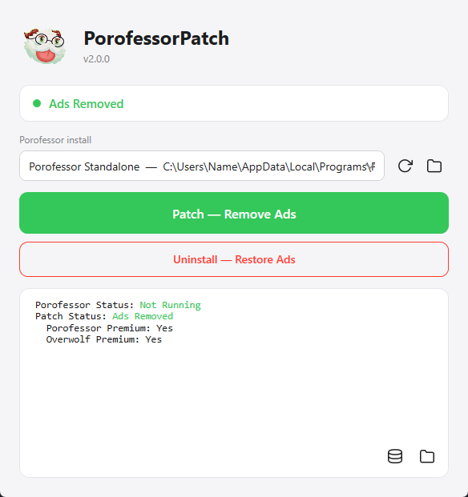
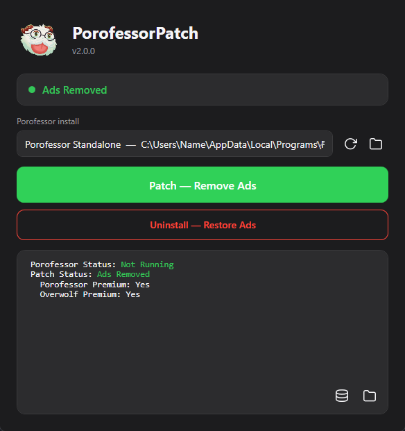

# PorofessorPatch

Removes ads from [Porofessor](https://porofessor.gg) Standalone.

## Screenshots





## What it does

Porofessor shows an ad to everyone who isn't a premium user. PorofessorPatch
turns on the same saved flags a premium account would set, so Porofessor stops
showing the ad. Nothing is deleted, nothing is patched, and the app itself is
never modified. You only run it once — the flags survive app updates.

The window has a status indicator, the Porofessor install location, and two
buttons:

- **Patch — Remove Ads**
- **Uninstall — Restore Ads**

Click the Porofessor mascot to switch between light and dark mode.

## Requirements

The app is a single .NET Framework 4.8 executable. That runtime is preinstalled
on Windows 10 (version 1903 and newer) and Windows 11, so no extra install is
needed there. On older Windows versions, install the
[.NET Framework 4.8 runtime](https://dotnet.microsoft.com/download/dotnet-framework/net48).

## Building from source

Requires the .NET SDK (8.0 or newer):

```sh
dotnet build src/PorofessorPatch/PorofessorPatch.csproj -c Release
```

Output: `src/PorofessorPatch/bin/Release/net48/PorofessorPatch.exe` (a single
native exe, ~600 KB, for Windows 10/11).

Releases are built by GitHub Actions and ship with a sha256 checksum.
