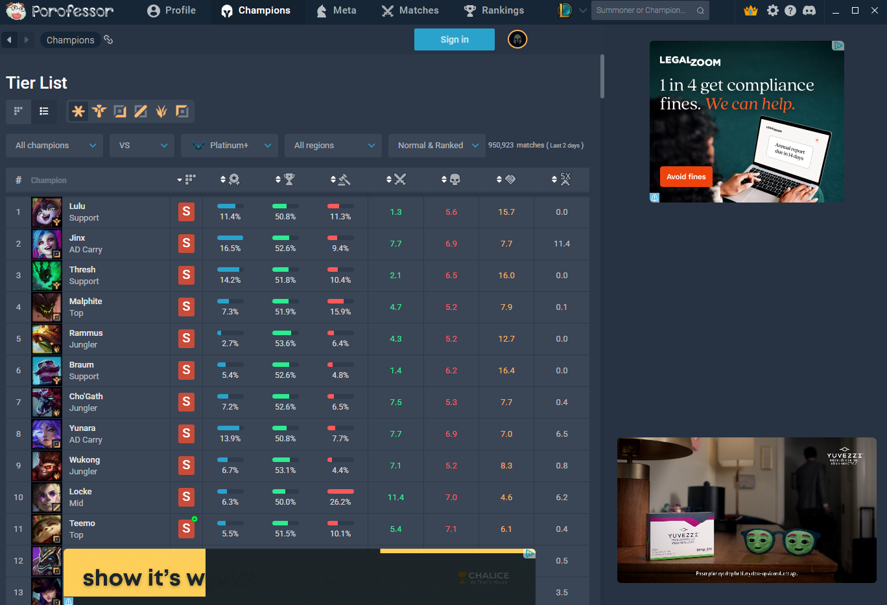

# PorofessorPatch

Removes ads from [Porofessor](https://porofessor.gg) Standalone.

Porofessor shows ads unless you're a premium user. PorofessorPatch turns on the
same flag premium users have, so the ads go away. Porofessor itself is never
changed.

Buttons:

- **Patch — Remove Ads**
- **Uninstall — Restore Ads**

Click the Porofessor mascot to switch light/dark mode.

## Screenshots


<details>
<summary>Before / after — with ads vs. ads removed</summary>




</details>

## Building from source

Requires the [.NET SDK](https://dotnet.microsoft.com/download) (8.0 or newer):

```sh
dotnet build src/PorofessorPatch/PorofessorPatch.csproj -c Release
```

Output: `src/PorofessorPatch/bin/Release/net48/PorofessorPatch.exe` (a single
native exe, ~600 KB, for Windows 10/11).

Releases are built by GitHub Actions and ship with a sha256 checksum.
